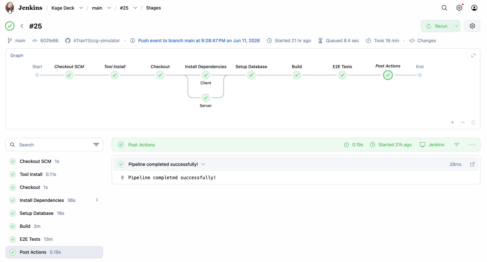
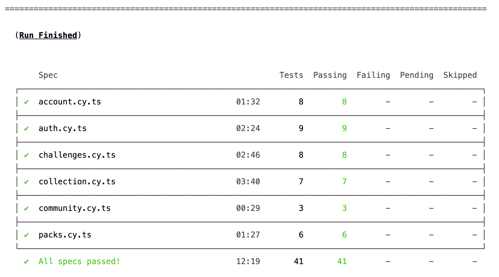

# CI/CD Pipeline

Kage Deck's application code lives in a private repository, but its automated
testing and delivery pipeline is described here. The pipeline runs a full
end-to-end test suite on every push to Github.

> **Note:** Screenshots below are from the live pipeline. The source repository
> is private; this page documents the engineering behind the build.

---

## Stack

| Stage | Tooling |
|-------|---------|
| Trigger | GitHub webhook → Jenkins Multibranch Pipeline |
| Build | Node 20, Vite (client), TypeScript (server) |
| Database | PostgreSQL, schema managed by Prisma |
| Tests | Cypress end-to-end suite (41 tests across 6 specs) |
| Host | DigitalOcean droplet |

## Flow

1. A push to `main` fires a GitHub webhook.
2. Jenkins (Multibranch Pipeline) picks up the push **event** and starts a build.
3. Dependencies install for client and server in parallel.
4. A throwaway Postgres test database is reset and seeded via Prisma.
5. The client builds; the server starts in a test configuration.
6. Cypress runs the full E2E suite against the running stack.

---

## Screenshots

**Pipeline (Jenkins stage view)**

**E2E test summary (Cypress)**

---

## Engineering notes

A few problems solved while building the pipeline.

**Tracing a webhook that silently stopped triggering builds.**
After the repository was made private, pushes stopped producing builds with no
error anywhere. Logs confirmed the webhook was arriving and matching the job, so
the failure was downstream: the job used hook-triggered SCM *polling*, which
authenticates to the repository anonymously. That path worked while the repo was
public and broke silently once it required credentials. Resolved by moving to a
**Multibranch Pipeline**, which builds on authenticated GitHub push *events* rather
than polling — eliminating the fragile poke-then-poll handoff entirely.

**Keeping test/prod parity while neutralizing checks that can't run in CI.**
Registration is gated by a Cloudflare Turnstile captcha and a server-side content
filter, neither of which can run meaningfully in a headless CI browser. Rather than
weakening the real checks, both are bypassed only via explicit environment flags
that default to *on*, so production behavior is never affected and the test suite
stays deterministic. The same pattern gates rate limiting in CI.

**Diagnosing a CI-only failure by reasoning about application state.**
A Cypress test passed locally but timed out in CI. The page renders cards only in
its logged-in branch; in CI the auth store hadn't finished hydrating its token by
render time, so the page committed to the logged-out view before the test looked
for cards. The fix was to assert on a logged-in-only element first and waiting for
the app to reach the required *state* rather than racing a network call. The
broader takeaway: local-vs-CI flakiness is usually a state or timing assumption,
not randomness.

---

Application source is private. This page documents the CI/CD setup only.
